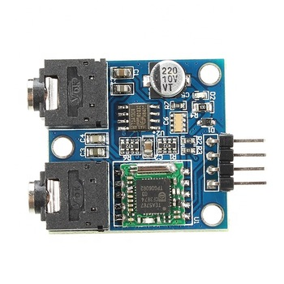

# pxt-TEA5767

This is an extension for Microsoft Makecode to use a TEA5767 radio module with your micro:bit.
Developed by Anson from Kittenbot HK.



## License

MIT

## Use as Extension

This repository can be added as an **extension** in MakeCode.

* open [https://makecode.microbit.org/](https://makecode.microbit.org/)
* click on **New Project**
* click on **Extensions** under the gearwheel menu
* search for **https://github.com/kittenbothk/tea57671111** and import

#### Metadata (used for search, rendering)

* for PXT/microbit
* for PXT/meowbit

```package
TEA5767=github:kittenbothk/pxt-TEA5767
```

